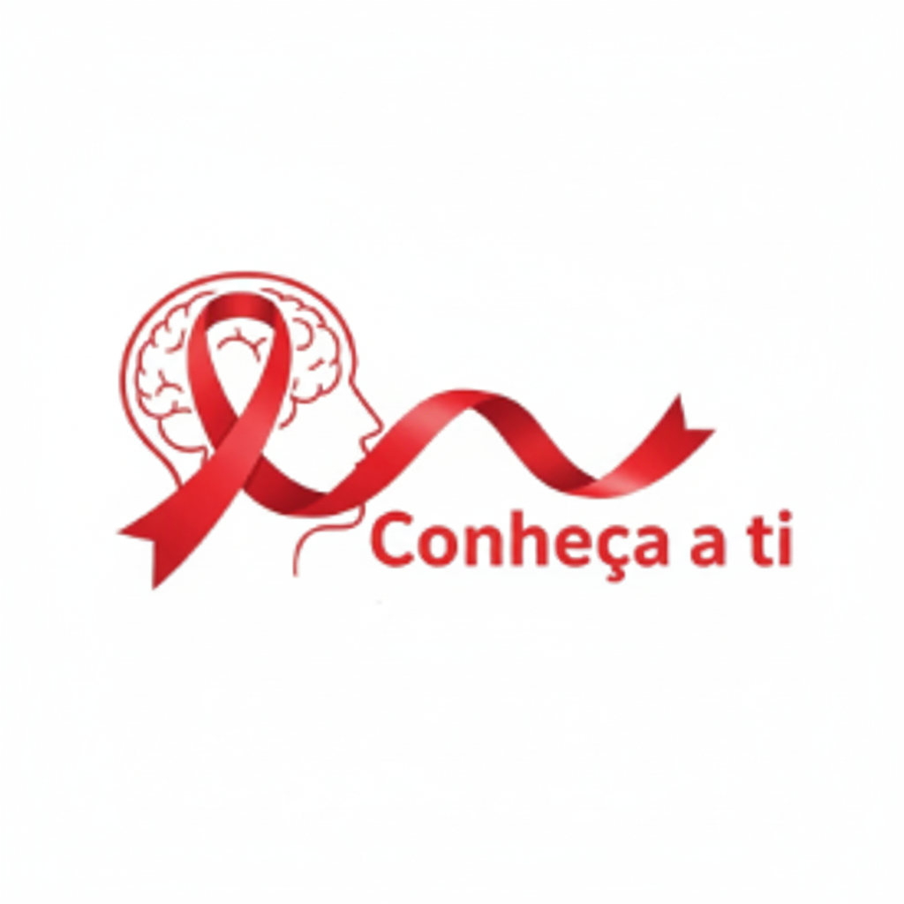

# Cuidar+ | Informação que Acolhe sobre HIV 🎗️

  

## 📌 Sobre o Projeto

O **Cuidar+** é uma página web informativa e de acolhimento, desenvolvida com o objetivo de centralizar informações essenciais sobre o HIV/AIDS. O projeto busca oferecer um ambiente seguro, anônimo e de fácil acesso para que os usuários possam aprender sobre prevenção, testagem, tratamento e desmistificar mitos comuns associados ao vírus.

A principal missão do site é transformar o cuidado através da informação, reforçando a importância do conhecimento como ferramenta de poder e saúde.

## ✨ Funcionalidades Principais

O site foi estruturado de forma clara e intuitiva para guiar o usuário em sua jornada de conhecimento:

* **Header de Navegação Completo:** 🧭
    * Links para seções importantes como: `O que é HIV?`, `Prevenção (PrEP/PEP)`, `Testagem`, `Tratamento`, `Mitos e Verdades` e a campanha `Dezembro Vermelho`.
    * Botão de CTA (Call to Action) para "Encontre um Local de Teste".
* **Seção Hero de Impacto:** 📢
    * Apresenta o slogan do projeto: "Informação que Acolhe, Cuidado que Transforma".
* **Cards Informativos:** 🃏
    * Uma seção visual para responder às perguntas mais fundamentais: O que é o HIV?, O que é a AIDS?, Como o vírus é transmitido? e, igualmente importante, Como NÃO é transmitido?.
* **Busca por Locais de Testagem:** 🔎
    * Um formulário interativo que incentiva o usuário a encontrar o centro de testagem mais próximo.
* **Conceito I = I:** ❤️
    * Destaque para a importante mensagem de que **Indetectável = Intransmissível**, uma informação crucial para combater o estigma.
* **FAQ Anônimo:** ❓
    * Uma área para que os usuários possam enviar suas dúvidas anonimamente, ajudando a construir uma base de conhecimento comunitária.
* **Rodapé com Links Úteis:** 🔗
    * Contém links para o Ministério da Saúde, UNAIDS Brasil e o contato do Disque Saúde (136).

## 💻 Tecnologias Utilizadas

Este projeto foi construído utilizando tecnologias web fundamentais, focando em uma experiência de usuário limpa e responsiva.

* **HTML5:** Para a estruturação e semântica do conteúdo.
* **CSS3:** Para a estilização, layout e responsividade, utilizando uma abordagem *Mobile-First*.
* **JavaScript:** Para interações dinâmicas, como o menu hambúrguer em dispositivos móveis.
* **Google Fonts:** Para a tipografia (família Poppins).
* **Font Awesome:** Para os ícones utilizados nas seções.

## 📂 Estrutura de Arquivos

O projeto está organizado da seguinte forma: